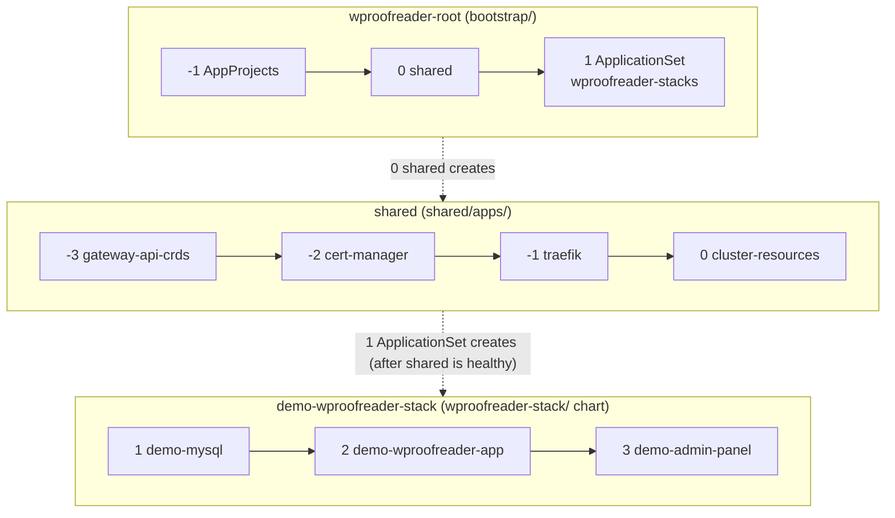

# Deploy the WProofreader stack with Argo CD

This directory contains the complete Argo CD configuration for the WProofreader stack.
Apply `root-app.yaml` one time.
Argo CD then installs the Gateway API CRDs, cert-manager, Traefik, MySQL, WProofreader Server,
and Admin-panel in sync-wave order.
It reads the product charts from `wproofreader-helm`, `admin-panel-helm`, and `mysql-server-helm`,
and the values files from this repository.

The [Kubernetes installation guide](https://docs.wproofreader.com/deployment/installation/kubernetes)
installs the same charts with Helm commands.
It uses the same namespace (`wsc`), release names, and Secrets.

| Component | Version |
| --- | --- |
| Kubernetes | 1.31 or later |
| Argo CD | 3.5 |
| Gateway API CRDs | v1.6.1, standard channel |
| cert-manager | v1.21.1 |
| Traefik chart | 41.5.0 (Traefik 3.7) |
| mysql-server-helm | chart 1.0.0 or later, MySQL 8.4 |
| wproofreader-helm | chart 1.4.0 or later (WProofreader Server 6.18.1.0 or later) |
| admin-panel-helm | chart 1.0.0 or later (Admin-panel 3.0.0 or later) |

The product charts are pinned to release tags in `wproofreader-stack/values.yaml`.
See [Pinned versions](../README.md#pinned-versions).

## Layout

```
argocd/
├── root-app.yaml                 # the ONE file you apply: `root` AppProject + root Application `wproofreader-root`
├── root-app-no-shared.yaml       # the same, for clusters that already have a GatewayClass and a ClusterIssuer
├── argocd-cm-health-patch.yaml   # one-time argocd-cm patch (health check for Applications)
├── bootstrap/                    # what the root syncs (recursively), in sync-wave order
│   ├── projects/                     wave -1  AppProjects: bootstrap, shared, wproofreader
│   ├── shared.yaml                   wave  0  App-of-Apps -> shared/apps
│   └── wproofreader-stacks.yaml      wave  1  ApplicationSet: one stack for each environments/<name>/
├── shared/                       # cluster components (project `shared`, the only project with cluster-scoped rights)
│   ├── apps/
│   │   ├── 00-gateway-api-crds.yaml   wave -3  Gateway API CRDs v1.6.1
│   │   ├── 01-cert-manager.yaml       wave -2  cert-manager v1.21.1 and its CRDs
│   │   ├── 02-traefik.yaml            wave -1  Traefik chart 41.5.0 (Gateway API provider only)
│   │   └── 03-cluster-resources.yaml  wave  0  self-signed ClusterIssuer
│   ├── cert-manager/values.yaml   # plain Helm values files, loaded through multiple sources ($values/...)
│   ├── traefik/values.yaml
│   ├── gateway-api-crds/          # kustomize wrapper for the Gateway API release manifest
│   └── cluster-resources/         # self-signed ClusterIssuer
├── wproofreader-stack/           # Helm chart that renders the 3 product Applications of ONE environment
│   ├── values.yaml                # chart repositories and pinned revisions
│   └── templates/                 # mysql (wave 1), wproofreader-app (wave 2), admin-panel (wave 3)
└── environments/                 # one directory for each environment = one complete stack
    └── demo/
        ├── stack.yaml             # namespace of the environment
        ├── mysql.yaml             # plain Helm values files (also for `helm install --values`)
        ├── wproofreader-app.yaml
        └── admin-panel.yaml       # host name, Gateway, TLS, and /wscservice routing
```

All Application paths start at the repository root (`argocd/...`).

The `shared` Application installs the cluster components in sync-wave order.
If the cluster already has a GatewayClass and a ClusterIssuer,
apply `root-app-no-shared.yaml` instead of `root-app.yaml`.
Then set `gateway.gatewayClassName` and `gateway.tls.certManager.issuerRef` in `admin-panel.yaml` to
the existing objects.

The `wproofreader-stacks` ApplicationSet has a Git files generator
for `argocd/environments/*/stack.yaml`.
For each directory, it creates an `<environment>-wproofreader-stack` Application from
the `wproofreader-stack/` chart.
That Application creates the three product Applications of the environment.

Each product Application has two sources: the chart repository,
and this repository with `ref: values`.
The chart reads its values file from `$values/argocd/environments/<environment>/`.
The Applications contain no inline values.

## Projects

| Project | Used by | Destinations | Cluster-scoped resources |
| --- | --- | --- | --- |
| `root` | the root Application | `argocd` (AppProject, Application, ApplicationSet) | none. `root-app.yaml` defines it; apply that file again to change it |
| `bootstrap` | `shared` and each `<environment>-wproofreader-stack` | `argocd` (Applications only) | none |
| `shared` | Gateway API CRDs, cert-manager, Traefik, ClusterIssuer | `cert-manager`, `traefik`, `kube-system` | the kinds listed in `bootstrap/projects/shared.yaml` |
| `wproofreader` | the product Applications of all environments | the namespaces listed in `bootstrap/projects/wproofreader.yaml` | none |

The root syncs the projects in `bootstrap/projects/` from Git.
Add the namespace of each environment to `bootstrap/projects/wproofreader.yaml`.
Argo CD rejects destinations that are not in that list.

## Order of deployment

Argo CD deploys the stack in three levels.
On each level, sync waves set the order: Argo CD applies lower `argocd.argoproj.io/sync-wave` values
first, and it starts the next wave when the previous wave is healthy.



| Level | Wave | Application or object | What happens |
| --- | --- | --- | --- |
| `wproofreader-root` | -1 | AppProjects `bootstrap`, `shared`, `wproofreader` | Argo CD creates the permission boundaries. |
| | 0 | `shared` | Argo CD installs the cluster components (next level). |
| | 1 | ApplicationSet `wproofreader-stacks` | Argo CD creates one `<environment>-wproofreader-stack` for each `environments/*/stack.yaml`. |
| `shared` | -3 | `gateway-api-crds` | The Gateway API CRDs v1.6.1 are installed. |
| | -2 | `cert-manager` | cert-manager and its CRDs start. |
| | -1 | `traefik` | Traefik starts and registers the `traefik` GatewayClass. Its Service must get an external address. |
| | 0 | `cluster-resources` | The `selfsigned` ClusterIssuer is created. |
| `demo-wproofreader-stack` | 1 | `demo-mysql` | MySQL starts and creates `admin_panel_db` and the `admin_panel` user. |
| | 2 | `demo-wproofreader-app` | The db-manager hook Job creates `cloud_service` and its users. Then WProofreader Server starts. |
| | 3 | `demo-admin-panel` | The migration hook Job creates the tables in `admin_panel_db`. Then the web, worker, and scheduler Pods start. |

If an Application is not healthy, the waves after it do not start.
To find the Application that blocks the deployment, run:

```bash
kubectl -n argocd get applications
```

Two Argo CD behaviors are important:

- Argo CD has no built-in health check for the `Application` kind.
  Without it, a parent Application does not wait until a child Application is healthy.
  Apply `argocd-cm-health-patch.yaml` one time after you install Argo CD.
- The order of new Applications is best effort, also with the health check.
  Argo CD reads health from its cache, and a new object can arrive in the cache a few seconds late.
  Thus, the next wave can start too early.
  Each Application has a `retry` policy, and the hook Jobs wait for MySQL.
  An early start causes a retry, not a failure.

The db-manager Job of WProofreader Server and the migration Job of Admin-panel are Helm
`pre-install,pre-upgrade` hooks.
Argo CD runs them as PreSync hooks.

## Step by step

This procedure deploys the `demo` environment from this repository, without changes.
Use it on a test cluster to see how the stack starts and how Argo CD shows it.

To deploy your own configuration, first make your own copy of the repository.
See [Make your own copy](../README.md#make-your-own-copy).
Then use the same steps with your copy.

### 0. Prerequisites

- `kubectl`, `openssl`, and `git`.
- A WProofreader license ticket ID.
- A Kubernetes cluster.
  See step 1.

### 1. Prepare the cluster

You can use any Kubernetes cluster that meets these requirements:

- Kubernetes 1.31 or later.
- A LoadBalancer implementation.
  The Traefik Service must get an external address.
  If it stays `<pending>`, the `shared` Application does not become healthy.
- A default StorageClass.
  MySQL keeps its data on an 8 GiB volume.
- Approximately 6 CPUs and 12 GiB of memory that are free for the stack.

Make sure that `kubectl` uses this cluster:

```bash
kubectl config current-context
kubectl version
```

The server version must be 1.31 or later.

These examples create a local test cluster.
Use one of them, or use a cluster that you already have.

<details>
<summary>minikube</summary>

```bash
minikube start --cpus=6 --memory=12g
```

minikube 1.34 or later starts Kubernetes 1.31 or later by default.
For an older minikube, add `--kubernetes-version=v1.31.0`.

In a second terminal, start the tunnel and keep it running.
It gives LoadBalancer addresses to Services:

```bash
minikube tunnel
```

The tunnel can ask for your password, because it opens ports 80 and 443.

</details>

<details>
<summary>kind</summary>

```bash
kind create cluster --name wproofreader --image kindest/node:v1.31.9
```

In a second terminal, start
[cloud-provider-kind](https://github.com/kubernetes-sigs/cloud-provider-kind) and keep it running.
It gives LoadBalancer addresses to Services:

```bash
sudo cloud-provider-kind
```

Give Docker approximately 6 CPUs and 12 GiB of memory.

</details>

<details>
<summary>Managed cluster (EKS, AKS, GKE, or other)</summary>

A managed cluster usually has a LoadBalancer implementation and a default StorageClass.
Make sure that the Kubernetes version is 1.31 or later.
A LoadBalancer Service can cost money and can be reachable from the internet.
Remove the stack when you complete the test.

</details>

Clone this repository:

```bash
git clone https://github.com/WebSpellChecker/wproofreader-gitops.git
cd wproofreader-gitops
```

### 2. Install Argo CD

```bash
kubectl create namespace argocd
kubectl apply -n argocd --server-side \
  -f https://raw.githubusercontent.com/argoproj/argo-cd/v3.5.3/manifests/install.yaml
kubectl -n argocd rollout status deployment/argocd-server --timeout=180s
kubectl -n argocd patch configmap argocd-cm --type merge \
  --patch-file argocd/argocd-cm-health-patch.yaml
```

Use `--server-side`.
The ApplicationSet CRD is too large for client-side apply.

To open the Argo CD UI, get the `admin` password and start a port forward:

```bash
kubectl -n argocd get secret argocd-initial-admin-secret \
  -o jsonpath='{.data.password}' | base64 -d; echo
kubectl -n argocd port-forward service/argocd-server 8080:443
```

Then open `https://localhost:8080` and sign in as `admin`.

### 3. Optional: give Argo CD access to private repositories

Skip this step if Argo CD can read the repositories without credentials.
If you use private copies of the repositories, create a repository credential template
for their organization.
Replace the placeholders:

```bash
kubectl -n argocd create secret generic github-creds \
  --from-literal=type=git \
  --from-literal=url=https://github.com/<organization> \
  --from-literal=username='<user>' \
  --from-literal=password='<read_only_token>'
kubectl -n argocd label secret github-creds \
  argocd.argoproj.io/secret-type=repo-creds
```


### 4. Create the namespace and the Secrets

Create the namespace and the four Secrets before the first sync.
Argo CD reads these Secrets, but it does not create or delete them.
Use the commands in the [repository README](../README.md#secrets).
They create the `wsc` namespace and the Secrets `mysql-credentials`, `wproofreader-db`,
`wproofreader-license`, and `admin-panel-secrets`.

### 5. Deploy the stack

```bash
kubectl apply -n argocd -f argocd/root-app.yaml
```

The root Application `wproofreader-root` syncs `argocd/bootstrap/`.
Wave -1 creates the AppProjects, wave 0 creates `shared`,
and wave 1 creates the `wproofreader-stacks` ApplicationSet.
The ApplicationSet finds `argocd/environments/demo/stack.yaml`
and creates `demo-wproofreader-stack`.

### 6. Monitor the sync

```bash
kubectl -n argocd get applications --watch
```

The `shared` Application installs the cluster components.
Then `demo-wproofreader-stack` creates `demo-mysql`, `demo-wproofreader-app`,
and `demo-admin-panel` in this order.
The first sync takes approximately 10 minutes.
Most of the time is for image downloads.

Wait until all Applications show `Synced` and `Healthy`.
During the first sync, `gateway-api-crds` and its parents `shared`
and `wproofreader-root` can show `Degraded` for some minutes.
They become `Healthy` without action.
The status of the ApplicationSet does not show the health of the workloads.
Look at the Applications for that.

You can monitor the Pods in the `wsc` namespace, also the Pods of the hook Jobs:

```bash
kubectl -n wsc get pods --watch
```

The `wproofreader-app-db-provision` Job completes before the WProofreader Server Pod starts.
The `admin-panel-migrate` Job completes before the Admin-panel web, worker,
and scheduler Pods start.

### 7. Check the stack

Get the external address of Traefik:

```bash
LB_IP="$(kubectl -n traefik get service traefik \
  -o jsonpath='{.status.loadBalancer.ingress[0].ip}')"
echo "${LB_IP}"
```

Check the Gateway, the routes, and the certificate:

```bash
kubectl -n wsc get gateway,httproute,certificate
```

The Gateway shows `PROGRAMMED True`, and the certificate shows `READY True`.

Send requests to Admin-panel and WProofreader Server.
`wproofreader.example.com` is the host name of the `demo` environment.
If you changed the host name in your copy, use your host name in this step and in step 8.
The `--resolve` option sends the host name to the Traefik address, so you do not need a DNS record.
If a DNS record for your host name already points to the Traefik address,
you can remove `--resolve`:

```bash
H=wproofreader.example.com
curl --silent --output /dev/null --write-out '%{http_code}\n' \
  --resolve "${H}:80:${LB_IP}" "http://${H}/up"
curl --silent --insecure --output /dev/null --write-out '%{http_code}\n' \
  --resolve "${H}:443:${LB_IP}" "https://${H}/up"
curl --silent --insecure --resolve "${H}:443:${LB_IP}" \
  "https://${H}/wscservice/api?cmd=ver"
curl --silent --insecure --resolve "${H}:443:${LB_IP}" \
  "https://${H}/wscservice/api?cmd=license_status"
```

The first command shows `301` (redirect to HTTPS).
The second command shows `200`.
The third response contains `"ProgramVersion"` and the WProofreader Server version,
and the fourth response contains `"valid":true`.

### 8. Create the first administrator

To open Admin-panel in a web browser, add this line to `/etc/hosts`.
Replace `<LB_IP>` with the address from step 7:

```
<LB_IP> wproofreader.example.com
```

If a DNS record for your host name already points to the Traefik address, skip this change.

Get a setup link:

```bash
kubectl -n wsc exec deployment/admin-panel-web -- \
  php artisan app:setup-token --regenerate --no-ansi
```

Open the setup URL from the output.
The certificate is self-signed, so the browser shows a warning.
Create the administrator, then sign in.
The demo writes email to the log.
To get invitation links, read the log of the web Pod:

```bash
kubectl -n wsc logs deployment/admin-panel-web
```

## Add an environment

Copy the `demo` environment:

```bash
cp -r argocd/environments/demo argocd/environments/production
```

1. Set the namespace in `environments/production/stack.yaml`.
2. Add the namespace to `destinations` in `bootstrap/projects/wproofreader.yaml`.
3. Change the values files: host name, issuer, storage sizes, and resources.
   Also change the namespace in these addresses: `config.db.host`, `config.serviceDb.host`,
   and `config.appServerInternalUrl` in `admin-panel.yaml`,
   and `database.host` in `wproofreader-app.yaml`.
   Do not change the release names.
   The addresses `mysql-primary.<namespace>` and `wproofreader-app.<namespace>` use them.
4. Create the namespace and its Secrets.
   The Applications do not create the namespace.
5. Commit and push.
   The ApplicationSet creates `production-wproofreader-stack`.

## Change a chart version

The product charts are pinned to release tags in `wproofreader-stack/values.yaml`.
Change the revision to the new tag, then commit and push.
The tag must exist in the remote chart repository.
If the release moves the chart to a different directory, also change `path:` in
the template of the chart in `wproofreader-stack/templates/`.

Before you upgrade, back up `admin_panel_db` and `cloud_service`.
A rollback does not undo database migrations.

The cert-manager and Traefik versions are in `shared/apps/`.
Change the Traefik chart version and the Gateway API version
in `shared/gateway-api-crds/kustomization.yaml` together.

## Remove the stack

To remove a local test cluster, delete it, for example `minikube delete`
or `kind delete cluster --name wproofreader`.

To remove one environment and keep the shared components,
delete the directory of the environment from Git.
If you delete the generated `<environment>-wproofreader-stack` Application directly,
the ApplicationSet creates it again.

```bash
git rm -r argocd/environments/demo
git commit -m "Remove the demo environment"
git push
kubectl -n argocd get applications --watch
```

The ApplicationSet deletes `demo-wproofreader-stack`.
Its finalizers delete the three product Applications and their workloads.
The namespace, the Secrets, and the MySQL volume stay.
To delete them also:

```bash
kubectl delete namespace wsc
```

This deletes the MySQL data.
Back up the databases first.

To remove all Applications of the root:

```bash
kubectl -n argocd delete application wproofreader-root
```

The child Applications of `shared` have no finalizers.
Thus, cert-manager, Traefik, and the Gateway API CRDs stay in the cluster.
Remove them manually if you do not need them.
