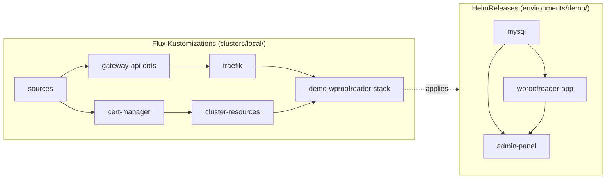

# Deploy the WProofreader stack with Flux

This directory contains the complete Flux configuration for the WProofreader stack.
Apply `root.yaml` one time.
Flux then installs the Gateway API CRDs, cert-manager, Traefik, MySQL, WProofreader Server,
and Admin-panel in dependency order.
It reads the product charts from `wproofreader-helm`, `admin-panel-helm`, and `mysql-server-helm`,
and the values files from this repository.

The [Kubernetes installation guide](https://docs.wproofreader.com/deployment/installation/kubernetes)
installs the same charts with Helm commands.
It uses the same namespace (`wsc`), release names, and Secrets.

| Component | Version |
| --- | --- |
| Kubernetes | 1.33 or later (Flux 2.9 needs 1.33; the Gateway API CRDs need 1.31) |
| Flux | 2.9 |
| Gateway API CRDs | v1.6.1, standard channel |
| cert-manager | v1.21.1 |
| Traefik chart | 41.5.0 (Traefik 3.7) |
| mysql-server-helm | chart 1.0.0 or later, MySQL 8.4 |
| wproofreader-helm | chart 1.4.0 or later (WProofreader Server 6.18.1.0 or later) |
| admin-panel-helm | chart 1.0.0 or later (Admin-panel 3.0.0 or later) |

The product charts are pinned to release tags in `sources/charts.yaml`.
See [Pinned versions](../README.md#pinned-versions).

## Layout

```
flux/
├── root.yaml                   # the ONE file you apply: GitRepository `wproofreader-gitops` + root Kustomization `wproofreader-root`
├── kustomizeconfig.yaml        # lets kustomize change generated ConfigMap names in HelmRelease.valuesFrom
├── clusters/
│   └── local/                  # what the root syncs: one Flux Kustomization for each layer (dependsOn sets the order)
│       ├── sources.yaml            -> flux/sources
│       ├── shared.yaml             gateway-api-crds, cert-manager, traefik, cluster-resources
│       └── demo-wproofreader-stack.yaml  -> flux/environments/demo   (one file for each environment)
├── sources/                    # GitRepository objects for the 3 product charts (pinned release tags) and Gateway API v1.6.1,
│                               # HelmRepository objects for jetstack and traefik
├── shared/
│   ├── cert-manager/           # Namespace, HelmRelease v1.21.1, values.yaml (in a generated ConfigMap)
│   ├── traefik/                # Namespace, HelmRelease 41.5.0 (crds: Skip), values.yaml
│   └── cluster-resources/      # self-signed ClusterIssuer
└── environments/               # one directory for each environment = one complete stack
    └── demo/
        ├── kustomization.yaml  # namespace, the 3 HelmReleases, and 3 generated values ConfigMaps
        ├── mysql.yaml          # HelmReleases (order: mysql -> wproofreader-app -> admin-panel)
        ├── wproofreader-app.yaml
        ├── admin-panel.yaml
        └── values/             # plain Helm values files (also for `helm install --values`)
            ├── mysql.yaml
            ├── wproofreader-app.yaml
            └── admin-panel.yaml        # host name, Gateway, TLS, and /wscservice routing
```

All Kustomization paths start at the repository root (`./flux/...`).

## How the values files get to the charts

A HelmRelease reads values from ConfigMaps or Secrets (`valuesFrom`).
It cannot read a values file from Git directly.
Thus, each kustomization puts its values files into generated ConfigMaps:

```yaml
configMapGenerator:
  - name: admin-panel-values
    files:
      - values.yaml=values/admin-panel.yaml
configurations:
  - ../../kustomizeconfig.yaml
```

Kustomize adds a hash of the content to the ConfigMap name.
`kustomizeconfig.yaml` tells kustomize to use the same name in `HelmRelease.spec.valuesFrom`.
When you change a values file, the ConfigMap gets a new name,
and the HelmRelease reconciles. helm-controller upgrades the release only if
the values are different.
A change to a comment does not restart the workloads.

To see the manifests that kustomize-controller applies, run `flux build`:

```bash
flux build kustomization demo-wproofreader-stack \
  --kustomization-file flux/clusters/local/demo-wproofreader-stack.yaml \
  --path ./flux/environments/demo --dry-run
```

## Order of deployment

Flux deploys the stack in two levels:

1. Flux Kustomizations, one for each layer, in `clusters/local/`.
2. HelmReleases of an environment, in `environments/<environment>/`.

On both levels, `dependsOn` sets the order.
An object starts only when all objects in its `dependsOn` list are ready.



| Layer | Installs | Starts after | Is ready when |
| --- | --- | --- | --- |
| `sources` | GitRepository and HelmRepository objects | (first layer) | Flux has downloaded each chart source |
| `gateway-api-crds` | Gateway API CRDs v1.6.1 | `sources` | the CRDs are established |
| `cert-manager` | cert-manager and its CRDs | `sources` | the cert-manager Pods and webhook are ready |
| `traefik` | Traefik and the `traefik` GatewayClass | `gateway-api-crds` | the Traefik Pod is ready |
| `cluster-resources` | the `selfsigned` ClusterIssuer | `cert-manager` | the ClusterIssuer is ready |
| `demo-wproofreader-stack` | the three HelmReleases of the environment | `traefik` and `cluster-resources` | all three HelmReleases are ready |

Inside `demo-wproofreader-stack`, the HelmReleases start in this order:

| HelmRelease | Starts after | What happens |
| --- | --- | --- |
| `mysql` | (first) | MySQL starts and creates `admin_panel_db` and the `admin_panel` user. |
| `wproofreader-app` | `mysql` | The db-manager hook Job creates `cloud_service` and its users. Then WProofreader Server starts. |
| `admin-panel` | `mysql` and `wproofreader-app` | The migration hook Job creates the tables in `admin_panel_db`. Then the web, worker, and scheduler Pods start. |

Each Kustomization has `wait: true`.
Thus, a layer is ready only when all objects that it applied are healthy.
Each HelmRelease waits until Helm reports the release as ready. helm-controller runs `helm install`
and `helm upgrade`, so the db-manager Job and the migration Job run as usual Helm
`pre-install,pre-upgrade` hooks.

If a layer is not ready, the layers after it do not start.
To find the layer that blocks the deployment, run:

```bash
flux get kustomizations
flux get helmreleases --all-namespaces
```

## Step by step

This procedure deploys the `demo` environment from this repository, without changes.
Use it on a test cluster to see how the stack starts and how Flux shows it.

To deploy your own configuration, first make your own copy of the repository.
See [Make your own copy](../README.md#make-your-own-copy).
Then use the same steps with your copy.

### 0. Prerequisites

- `kubectl`, the `flux` CLI 2.9, `openssl`, and `git`.
- A WProofreader license ticket ID.
- A Kubernetes cluster.
  See step 1.

### 1. Prepare the cluster

You can use any Kubernetes cluster that meets these requirements:

- Kubernetes 1.33 or later.
  `flux check --pre` stops on earlier versions.
- A LoadBalancer implementation.
  The Traefik Service must get an external address.
  If it stays `<pending>`, the stack deploys, but you cannot reach it from outside the cluster.
- A default StorageClass.
  MySQL keeps its data on an 8 GiB volume.
- Approximately 6 CPUs and 12 GiB of memory that are free for the stack.

Make sure that `kubectl` uses this cluster:

```bash
kubectl config current-context
kubectl version
```

The server version must be 1.33 or later.

These examples create a local test cluster.
Use one of them, or use a cluster that you already have.

<details>
<summary>minikube</summary>

```bash
minikube start --cpus=6 --memory=12g
```

minikube 1.36 or later starts Kubernetes 1.33 or later by default.
For an older minikube, add `--kubernetes-version=v1.33.1`.

In a second terminal, start the tunnel and keep it running.
It gives LoadBalancer addresses to Services:

```bash
minikube tunnel
```

The tunnel can ask for your password, because it opens ports 80 and 443.

</details>

<details>
<summary>kind</summary>

```bash
kind create cluster --name wproofreader --image kindest/node:v1.33.1
```

In a second terminal, start
[cloud-provider-kind](https://github.com/kubernetes-sigs/cloud-provider-kind) and keep it running.
It gives LoadBalancer addresses to Services:

```bash
sudo cloud-provider-kind
```

Give Docker approximately 6 CPUs and 12 GiB of memory.

</details>

<details>
<summary>Managed cluster (EKS, AKS, GKE, or other)</summary>

A managed cluster usually has a LoadBalancer implementation and a default StorageClass.
Make sure that the Kubernetes version is 1.33 or later.
A LoadBalancer Service can cost money and can be reachable from the internet.
Remove the stack when you complete the test.

</details>

Clone this repository:

```bash
git clone https://github.com/WebSpellChecker/wproofreader-gitops.git
cd wproofreader-gitops
```

### 2. Install Flux

```bash
flux check --pre
flux install
flux check
```

`flux install` installs the controllers of the same version as the CLI into
the `flux-system` namespace.

### 3. Optional: give Flux access to private repositories

Skip this step if Flux can read the repositories without credentials.
If you use private copies of the repositories, create a Secret with a read-only token.
Replace the placeholders:

```bash
flux create secret git github-creds \
  --url=https://github.com/<organization>/wproofreader-gitops \
  --username='<user>' --password='<read_only_token>'
```

Then add this field to `spec` of each GitRepository that reads a private repository,
in `root.yaml` and `sources/charts.yaml`:

```yaml
  secretRef:
    name: github-creds
```


### 4. Create the namespace and the Secrets

Create the namespace and the four Secrets before the first reconciliation.
Flux reads these Secrets, but it does not create or delete them.
Use the commands in the [repository README](../README.md#secrets).
They create the `wsc` namespace and the Secrets `mysql-credentials`, `wproofreader-db`,
`wproofreader-license`, and `admin-panel-secrets`.

### 5. Deploy the stack

```bash
kubectl apply -f flux/root.yaml
```

The root Kustomization `wproofreader-root` syncs `flux/clusters/local/`.
That directory has one Flux Kustomization for each layer.
`sources` is first.
Then `gateway-api-crds` and `cert-manager` start, then `traefik` and `cluster-resources`.
The last layer, `demo-wproofreader-stack`, applies the three HelmReleases
in `flux/environments/demo/`.

If `flux bootstrap` already manages this repository, do not apply `root.yaml`.
Change `sourceRef.name: wproofreader-gitops` to `flux-system` in the files in `clusters/local/`,
and set the bootstrap `--path` to `flux/clusters/local`.

### 6. Monitor the reconciliation

```bash
flux get kustomizations --watch
flux get helmreleases --all-namespaces --watch
```

A Kustomization shows `dependency ... is not ready` until its dependencies are ready.
The first reconciliation takes approximately 10 minutes.
Most of the time is for image downloads.

In `demo-wproofreader-stack`, `mysql` installs first.
`wproofreader-app` waits for `mysql`, and `admin-panel` waits for `mysql` and `wproofreader-app`.
You can monitor the Pods in the `wsc` namespace, also the Pods of the hook Jobs:

```bash
kubectl -n wsc get pods --watch
```

The `wproofreader-app-db-provision` Job completes before the WProofreader Server Pod starts.
The `admin-panel-migrate` Job completes before the Admin-panel web, worker,
and scheduler Pods start.

`wproofreader-root` becomes ready when all layers are ready.
To reconcile immediately, run `flux reconcile kustomization wproofreader-root --with-source`.
To show all objects, run `flux tree kustomization wproofreader-root`.

### 7. Check the stack

Get the external address of Traefik:

```bash
LB_IP="$(kubectl -n traefik get service traefik \
  -o jsonpath='{.status.loadBalancer.ingress[0].ip}')"
echo "${LB_IP}"
```

Check the Gateway, the routes, and the certificate:

```bash
kubectl -n wsc get gateway,httproute,certificate
```

The Gateway shows `PROGRAMMED True`, and the certificate shows `READY True`.

Send requests to Admin-panel and WProofreader Server.
`wproofreader.example.com` is the host name of the `demo` environment.
If you changed the host name in your copy, use your host name in this step and in step 8.
The `--resolve` option sends the host name to the Traefik address, so you do not need a DNS record.
If a DNS record for your host name already points to the Traefik address,
you can remove `--resolve`:

```bash
H=wproofreader.example.com
curl --silent --output /dev/null --write-out '%{http_code}\n' \
  --resolve "${H}:80:${LB_IP}" "http://${H}/up"
curl --silent --insecure --output /dev/null --write-out '%{http_code}\n' \
  --resolve "${H}:443:${LB_IP}" "https://${H}/up"
curl --silent --insecure --resolve "${H}:443:${LB_IP}" \
  "https://${H}/wscservice/api?cmd=ver"
curl --silent --insecure --resolve "${H}:443:${LB_IP}" \
  "https://${H}/wscservice/api?cmd=license_status"
```

The first command shows `301` (redirect to HTTPS).
The second command shows `200`.
The third response contains `"ProgramVersion"` and the WProofreader Server version,
and the fourth response contains `"valid":true`.

### 8. Create the first administrator

To open Admin-panel in a web browser, add this line to `/etc/hosts`.
Replace `<LB_IP>` with the address from step 7:

```
<LB_IP> wproofreader.example.com
```

If a DNS record for your host name already points to the Traefik address, skip this change.

Get a setup link:

```bash
kubectl -n wsc exec deployment/admin-panel-web -- \
  php artisan app:setup-token --regenerate --no-ansi
```

Open the setup URL from the output.
The certificate is self-signed, so the browser shows a warning.
Create the administrator, then sign in.
The demo writes email to the log.
To get invitation links, read the log of the web Pod:

```bash
kubectl -n wsc logs deployment/admin-panel-web
```

## Add an environment

Copy the `demo` environment and its cluster file:

```bash
cp -r flux/environments/demo flux/environments/production
cp flux/clusters/local/demo-wproofreader-stack.yaml \
  flux/clusters/local/production-wproofreader-stack.yaml
```

1. Set `namespace:` in `environments/production/kustomization.yaml`.
2. Change the values files in `environments/production/values/`: host name, issuer,
   storage sizes, and resources.
   Also change the namespace in these addresses: `config.db.host`, `config.serviceDb.host`,
   and `config.appServerInternalUrl` in `admin-panel.yaml`,
   and `database.host` in `wproofreader-app.yaml`.
   Do not change the release names.
   The addresses `mysql-primary.<namespace>` and `wproofreader-app.<namespace>` use them.
3. In the new cluster file, set `metadata.name: production-wproofreader-stack`
   and `path: ./flux/environments/production`.
   Add the file to `clusters/local/kustomization.yaml`.
4. Create the namespace and its Secrets.
   The HelmReleases do not create the namespace.
5. Commit and push.

Flux does not create a stack from a directory automatically.
Each environment needs its cluster file.
For a second cluster, copy `clusters/local/` and keep only the environments of that cluster.

## Change a chart version

The product charts are pinned to release tags in `sources/charts.yaml` with `ref.tag`.
Change the tag, then commit and push.
The tag must exist in the remote chart repository.
If the release moves the chart to a different directory, also change `chart:` in
the HelmRelease in `environments/<environment>/`.
The HelmReleases use `reconcileStrategy: Revision`, so Flux packages a new revision also when
the chart version in `Chart.yaml` stays the same.

Before you upgrade, back up `admin_panel_db` and `cloud_service`.
A rollback does not undo database migrations.

The cert-manager and Traefik HelmReleases pin their chart `version`.
Change the Traefik chart version and the Gateway API tag in `sources/gateway-api.yaml` together.

## Remove the stack

To remove a local test cluster, delete it, for example `minikube delete`
or `kind delete cluster --name wproofreader`.

To remove one environment and keep the shared components, delete its cluster file from Git:

```bash
git rm flux/clusters/local/demo-wproofreader-stack.yaml
# remove the line demo-wproofreader-stack.yaml from flux/clusters/local/kustomization.yaml
git commit -am "Remove the demo environment"
git push
flux reconcile kustomization wproofreader-root --with-source
flux get helmreleases -n wsc
```

Flux deletes the Kustomization and its three HelmReleases,
and helm-controller uninstalls the releases.
The namespace, the Secrets, and the MySQL volume stay.
To delete them also:

```bash
kubectl delete namespace wsc
```

This deletes the MySQL data.
Back up the databases first.

To remove all layers of the root, and then Flux:

```bash
kubectl delete -f flux/root.yaml
flux uninstall
```

The Gateway API CRDs stay, because their Kustomization has `prune: false`.
The cert-manager CRDs also stay, because Helm does not delete CRDs.
The `wsc` namespace also stays, with the Secrets, the `admin-panel-tls` certificate Secret,
the completed db-manager Job, and the MySQL volume.
To delete them, run `kubectl delete namespace wsc`.
This deletes the MySQL data.

## Multi-tenancy

By default, kustomize-controller runs with cluster-admin rights.
Thus, a person who can merge changes into this repository can change any resource in the cluster.
If different teams operate different environments, use the Flux multi-tenancy lockdown
(`--no-cross-namespace-refs` and `--default-service-account`),
and give each environment Kustomization a `serviceAccountName`.
The HelmReleases in this directory refer to chart sources in `flux-system`.
With the lockdown, move these sources into the namespace of each environment.
